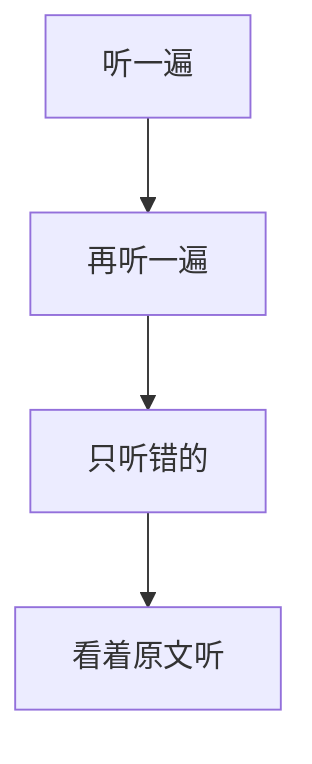

## 练习技巧

```mermaid
graph TB
    A[听一遍] --> B[再听一遍]--> C[只听错的]-->D[看着原文听]
```

### part1

* 听力只会放一遍
* 可以先预测答案
* 答案必是听力原词
* 定位不一定是原词
* 定位有可能是同意词

### part2

* 划关键词
* 同意替换

## 单词

* hectares 公顷
* habitat 栖息地
* leisure 空闲
* concentrate 全神贯注
* rhythm 节奏
