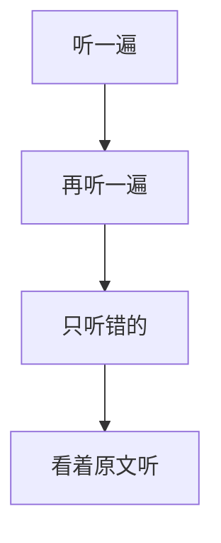

## part1

### 填空题

* 听力只会放一遍
* 可以先预测答案
* 答案必是听力原词
* 定位不一定是原词
* 定位有可能是同意词

## part2

### 选择题

* 重点可能在题目
* 答案一般是听力同意替换
* 答案一般是转折

### 地图题

## 单词

* hectares 公顷
* habitat 栖息地
* leisure 空闲
* concentrate 全神贯注
* rhythm 节奏
* cheese 奶酪
* demonstration 示威游行
