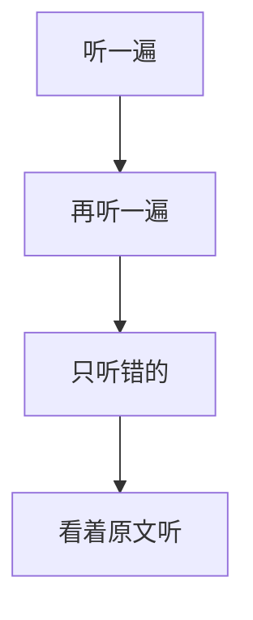

## part1

### 填空题

* 可以先预测答案
* 答案是听力原词
* 定位不一定是听力原词，大多是近义词

---

## part2

### 选择题

* 重点可能在题目
* 答案一般是听力近义词
* 答案一般在转折

### 地图题

* in
* left、right
* northern、
* far side from 远处的
* in a bend on 在转弯处
* forks 交叉口

---

## part3

### 多选题

* 不是按选项顺序在听力出现

### 匹配题

* 理解每个选项意思
* 听力有题目原词
* 听力有答案近义词

---

## part 4

### 填空题

* 可以先预测答案
* 答案是听力原词
* 定位不一定是听力原词，大多是近义词

---

## 生词

* hectares 公顷
* habitat 栖息地
* leisure 空闲
* concentrate 全神贯注
* rhythm 节奏
* cheese 奶酪
* demonstration 示威游行
* woods 树林
* temple 圣殿
* entry 进入
* sensors 传感器
* reuse 重复利用
* retailer 零售商
* chef 厨师
* aware of 发觉
* bog 沼泽
* soil 土壤

## 近义词

* waste/old bread
* satisfying/pleased/great feeling
* designs/patterns
* blind/visually impaired
* drinks/milk juice
* medical/drug/hospital/pharmacy
* weight/how many kilograms
* retailer/shop
* encourage/proactive
* lack of/deficiency
