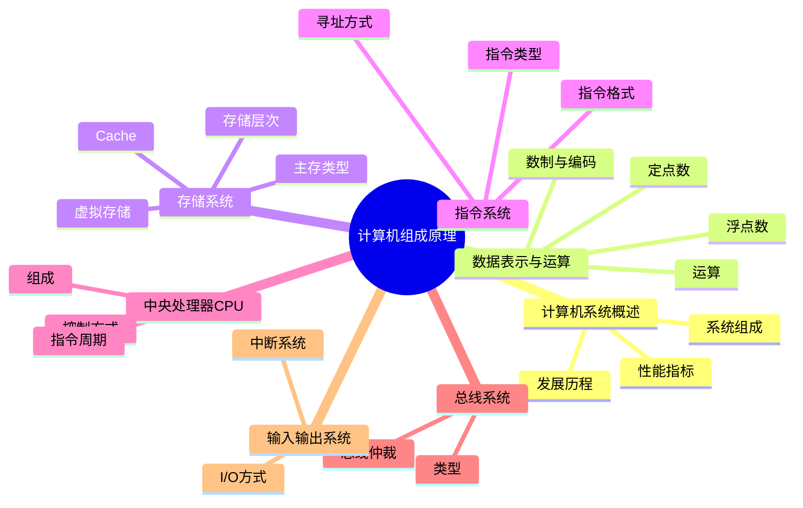

## 第二章 数据表示和运算

### C语言中的强制类型转换

* short->unsigned short: 变成补码的真值（位不变，只是把补码当作无符号数的真值解释）
* int->short: 高位截断
* short->int: 符号扩展:负数符号位和最高位之间补1,正数不变

### 定点数的加减运算

ps:在 补码加减法题里，默认给出的二进制/十六进制数就是补码表示

* 发生溢出使用十进制真值直接算

### IEEE 754浮点数

* 符号 1bit
* 阶码 8bit
* 尾数 23bit

### 数据的存储和排列

## 第四章 指令系统

### cisc和risc

|           | cisc         | risc                   |
| --------- | ------------ | ---------------------- |
| 寄存器    | 少           | 多                     |
| 流水线    | 通过一定方式 | 必须                   |
| 访/存指令 | 不限制       | load/store             |
| 控制机    | 微程序       | 组合逻辑/硬连线/硬布线 |

### 第五章 中央处理器

#### ISA

ISA：定长指令
硬件/微体系结构层：阵列乘法器、微程序控制器、单总线数据通路

#### 指令流水线

* 单周期 CPU 的时钟周期以最耗时指令所用的时间为准
* 流水线 CPU 的时钟周期以最长流水段所用时间为准

####

内存对齐:补充到n字节倍数再开始放
小端:高位单字节放高位

#### 寄存器

* 程序计数器(pc):下一条指令地址
* 通用寄存器

#### 控制器

* 译码
